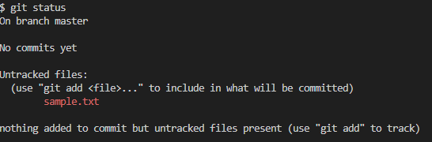
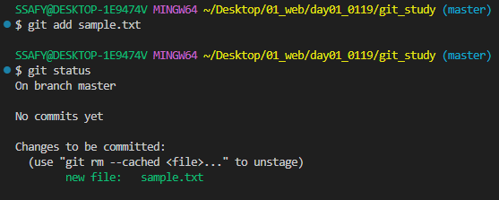
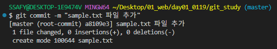
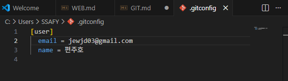

# Git
  - SSAFY에서 사용하는 프로그램
    - Gitlab: 싸피학생만 사용가능. private
## Git
  - *****분산***버전 관리 시스템**
  - 코드의 **변경 이력**을 기록하고 **협업**을 원활하게 하는 도구
### 버전 관리 
  - 변화를 기록하고 추적
  - google docs 등
  - 각 버전은 이전 버전으로부터의 **변경사항** 기록 
    - =>최종 버전이 전체 내용을 포함하는 게 아님
    - 각 버전 변경사항을 모두 합친 게 최종 버전이 되는 것
  - **왜 필요한가?**
    - 이전 요청사항으로 롤백 요청 발생 가능
    - 파일명으로 구분하기엔 뭘 수정했는지 구분 어려움
  - zip파일이나 드라이브는 불편, 호환성 문제 존재
### 중앙 집중식 vs 분산식
  - 중앙 집중식
    - 버전은 중앙 서버에 저장
    - 중앙 서버에서 파일 가져와 다시 중앙에 업로드
    - 드라이브 같은 것
    - 중앙서버 불나면 그대로 사라짐
    -  다른 사람이 작업한 걸 **그냥** 덮어쓸 가능성 존재
  - 분산식
    - 버전을 여러 개의 복제된 저장소에 저장/관리
      - 개발자들 간의 작업 충돌을 줄이고 생산성 향상
    - 중앙 서버의 장애, 손실에 대비 -> 백업, 복구 용이
    - 인터넷 연결 없이 작업 지속 가능
      - 변경 이력, 코드를 로컬 저장소에 기록 -> 나중에 중앙 서버와 동기화
    - 다른 사람이 같은 버전에서 작업한 것이 있으면 충돌 발생 -> 선택해서 반영 가능
### Git의 역할
  - 코드의 버전(히스토리 관리)

## git의 영역
### Working Directory
  - 실제 작업 중인 파일들이 위치하는 영역
  - 현재 디렉토리
  - CLI: pwd 써서 나오는 경로
### Staging Area
  - Working Directory에서 **변경된 파일** 중 **다음 버전에 포함시킬 파일**들을 선택적으로 추가하거나 제외할 수 있는 **중간 준비 영역**
  - ex. ver1 -> ver2의 **변경사항** 중 선택
    - git add
  - git add .
    - 전체 내용 staging area에 추가
    - 습관 들이면 위험
  - 변경한 파일을 잘 선택해서 저장할 수 있게 해라
### Repository
  - **버전(commit)** 이력과 파일들이 영구적으로 저장되는 영역
  - 모든 **버전(commit)과** 변경 이력 기록
  - 버전(commit)
    - 변경된 파일들을 저장하는 행위
## git의 동작
### git init
  - 로컬 저장소 설정(초기화)
  - git의 버전 관리를 시작할 디렉토리에서 진행
  - .git 폴더는 숨김 폴더이므로 보기->표시->숨긴 항목 체크해야 보임
### git status
  - 지금 작업중인 곳이 어떤 상황인지 확인
  - 습관적으로 확인하면 좋음
  - 비어있으면 no commits yet 이런거 뜬다
  
### git add
  - 변경사항이 있는 파일을 staging area에 추가
  - .git 파일에 임시 파일 형태로 등록되어있음
  
### git commit
  - staging area에 있는 파일들을 저장소에 기록
    - 해당 시점의 버전을 생성, 변경 이력 남김
  - git commit -m
    - 커밋 메시지 추가
    - 뭘 수정했는지 알 수 있게 직관적으로 작성하기
      
  - 파일을 누가 수정했는지 알 수 있게 해줘야함
    - 어느 저장소에 저장할지 지정
    
    - 엄밀히 말해 로그인이 아님. 그냥 누가했는지 메모해둔 것.
### git log
  - commit한 기록, 메시지 저장되어 있음
  - git log --oneline 
    - commit 목록 한 줄로 보기
    - 사용하지말기. 계속 누가 커밋중인지 확인할것.
### gitconfig
  - 일일히 계정바꾸기 귀찮으니 해당 명령어로 vscode에서 gitconfig 파일 열어서 직접 바꿔준다.

  - gitconfig 파일 열리면 직접 바꾸기

  - 변경된 로그
    
  - git config --list
    - CLI에서 바로 확인하는 방법
### git config --global -l
  - git global 설정 정보 보기
### git init 주의사항
  - git 로컬 저장소 내에 또다른 git 로컬 저장소 만들지 말 것.
    - git 로컬 저장소인 디렉토리 내부에서 git init 명령어 다시 입력하지 말것
  - git 저장소 안에 git 저장소가 있을 경우 가장 바깥쪽의 git 저장소가 안쪽의 git 저장소의 변경사항 추적 불가

## 로컬&원격 저장소
### 로컬 저장소
  - 현재 사용자가 직접 접속하고 있는 기기/시스템
  - 개인 컴퓨터, 노트북, 태블릿 등 직접 조작 환경
### 원격 저장소
  - 코드와 버전 관리 이력을 온라인 상의 특정 위치에 저장하여 여러 개발자가 협업하고 코드를 공유할 수 있는 저장 공간
  - GitHub, GitLab 등
  - 원격 저장소에 업로드하고 다른 로컬 저장소에서 내려받아서 계속 작성

## GitHub
 - 드라이브는 GUI 환경에 맞게 드래그&드랍 가능
 - 깃은 불가(add file 가능한데 굳이?)
 - CLI 환경에서 계속 작업 가능
### *SSAFY 시험문제, 과제풀이 깃허브에 퍼블릭으로 올리면 큰일남;;;*
  - 새로 올리려면 빈 폴더여야 한다. 
    - 뭐 있는 거에 냅다 작성한 거 추가하면 서로 다른 버전을 억지로 합치려고 하는 행위
    - 원격 저장소를 먼저 만들면 readme를 미리 만들어도 됨(근데 굳이?)
  - 폴더 주소를 알아야 업로드 가능
  - 하란대로하기
### remote
  - git remote add origin https://github.com/jewjd0/git_study.git
    - https://github.com/jewjd0/git_study.git 이 주소를 .git에 origin이란 닉네임으로 저장
    - 로컬 저장소에 원격 저장소 추가
    - git remote -v : remote된애 목록 확인
    - 닉네임 여러개 써서 로컬 저장소 한 개에 여러 원격 저장소 추가 가능.
      - github, gitlab에 둘다 저장 가능!
      - origin, second 뭐 이런걸로 닉네임 저장해서 한번에 관리하기
### push
  - git push -u origin master
    - 기본 main인데 설정변경한걸로 적용
  - commit한 내용을 remote한 저장소에 업로드
  - 처음 push시 로그인 필요
### pull & clone
  - remote한 저장소에서 내용을 받아옴
  - git pull 
    -  git pull origin master
    - 이미 파일이 있을 때 최신 변동사항 내려받기
  - git clone
    - git clone https://github.com/jewjd0/git_study.git
    - 새로 파일을 받아옴.
    - 맨 처음 집에 파일 받을 때 사용
    - git clone으로 받은 프로젝트는 이미 git init이 되어 있음
  - 강의장에서 push -> 집에서 pull,
  집에서 push -> 강의장에서 pull 루틴으로 잡기
### 최종 루틴
  - 과제나 실습 add -> commit -> 집가기전에 push
  - 집와서 pull -> 작업 add/commit 반복 -> 자기전에 push
  - 다시 강의장 와서 pull -> add/commit
## 자격 증명 관리자
### 자리 옮길 때 지우고 가야 하는 것
  - 지우면 git commit까진 가능. 
  - commit push를 하려면 다시 로그인해야함
## Git과 Github
