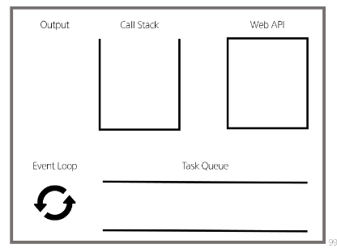

# Asynchronous JavaScript <br> (비동기 자바스크립트)
## 객체
- **객체(Object)** : **키**로 구분된 **데이터 집합**을 저장하는 참조 자료형(data collection)
### 구조와 속성
- 객체 구조
  - 중괄호로 작성
  - key: value쌍으로 구성된 속성 여러 개 작성 가능
  - key는 문자형만 허용
  - value는 모든 자료형 허용 (함수까지도)<br>
  ```javascript
    const user = {
      name: 'Alice',
      'key with space': true,
      greeting: function () { // Method
        return 'hello' //greeting이라는 키에 익명 함수가 할당된 형태
      }
    }
  ```
  - ++) 익명 함수에 대해
    - 변수에 함수를 작성해서 그 함수의 주소를 할당
- 속성 참조
  - 점'.' 혹은 대괄호'[]'로 객체 요소 접근 (대괄호를 사용하면 '문자열'로 key 작성)
  - key 이름에 공백, 특수문자 포함 시 **대괄호 접근만** 가능<br>
  ```javascript
    // 조회
    console.log(user.name) // Alice
    console.log(user['key with space']) // true
    // 추가
    user.address = 'korea' //새 키값 만들어서 바로 값 할당
    console.log(user) // {name: 'Alice', key with space: true, address: 'korea', greeting: ƒ}
    // 수정
    user.name = 'Bella'
    console.log(user.name) // Bella
    // 삭제
      delete user.name
      console.log(user) // {key with space: true,  address: 'korea', greeting: ƒ}
  ```
- in 연산자 : 속성이 객체에 존재하는지 확인 <br>
  ```javascript
    console.log('greeting' in user) // true
    console.log('country' in user) // false
  ```
### 객체와 함수
- Method : 객체 속성에 정의된 함수
  - object.method() 방식으로 호출
  - 메서드는 객체를 **행동**하게 함<br>
  ```javascript
    console.log(user.greeting()) // hello
  ```
### this
- this : 함수나 메서드를 **호출한 객체**를 가리키는 키워드 <br>
  => 함수 내에서 객체의 속성 및 메서드에 접근하기 위해 사용 <br>
```js
  // Method & this 예시
  const person = {
    name: 'Alice',
    greeting: function () {
      return `Hello my name is ${this.name}`
    },
  }
```
- JavaScript에서 this는 함수가 호출되는 방식에 따라 가리키는 대상이 달라짐
  - 단순 호출 : 전역 객체(window)를 가리킴
  - 메서드 호출 : 해당 메서드를 소유한 객체를 가리킴<br>
```js
  // 1.1 단순 호출
  const myFunc = function () {
    return this
  }
  console.log(myFunc()) // window

  // 1.2 메서드 호출
  const myObj = {
    data: 1,
    myFunc: function () {
      return this //this 호출된 순간 myobj 객체 내에 있었으므로 myobj를 반환
    }
  }
  console.log(myObj.myFunc()) // myObj
```
  - 중첩된 함수에서 this : 중첩된 함수 내에서 this는 전역 객체(window)를 가리킴 -> 이거 그냥 js에 있는 버그인가?<br>
```js
const myObj2 = {
      numbers: [1, 2, 3],
      myFunc: function () {
        this.numbers.forEach(function (number) {
          console.log(this) // window
          //this가 호출된 순간 중첩 함수 내에 있었음 -> 단순호출로 취급
          //1.1 단순호출처럼 function에서 호출한 취급
        })
      }
    }
    console.log(myObj2.myFunc())
```
  - 일반적으로 this는 호출되는 시점에 결정됨. <br>
  => 안쪽 함수에 딱히 객체가 없으므로 전역 객체를 가리키게 되는 것 <br>
  - 해결 방법
    - 화살표 함수(Arrow Function) 사용 : 화살표 함수는 자신만의 this를 가지지 않음 <br>
    => 외부 함수에서의 this를 그대로 사용<br>
    => 호출되었을 때 내가 포함되어있는 영역을 확인<br>
```js
const myObj3 = {
      numbers: [1, 2, 3],
      myFunc: function () {
        this.numbers.forEach((number) => {
          console.log(this) // myObj3
          //화살표 함수 내의 this -> this 호출된 순간 이 함수가 어디 포함되었는지 확안
        })
      }
    }
    console.log(myObj3.myFunc())
```
  - 바로 상위 단계의 this를 따라가기 때문에 중첩된 함수 내에서도 원하는 객체를 가리킬 수 있음
  - 일단 this 써보고 안나온다 싶으면 화살표 함수로 바꿔보기!
  - 정리할 때 교재 24p 추가 참고
  - 함수 호출이면 한번은 밖에 나가본다. 한번 나가서 객체 있으면 그건 객체 반환. 근데 두번 중첩이면 한번 나갔을때 함수가 있으니까 함수 내 호출 취급-> 단순호출. 화살표함수는 함수아닌취급인가?
  - 공식문서에 화살표함수는 메서드로 쓰는 게 아니고 인수로 사용, 자체 바인딩이 this에 없다는데 이거때문인가? 함수같은 기능을 하는 인수에 저장해서쓰는 무언가 -> 함수아니니까 중첩함수를 단일함수로 생각 -> 한번 밖에 나가서 객체 있으니 객체를 반환?
  
### 추가 객체 문법
- 단축 속성 : 키 이름과 변수 이름이 같은 경우 단축 구문 사용 가능<br>
```js
  const name = 'Alice'
  const age = 25
  // 1. 단축 속성
  const user1 = {
    name: name,
    age: age
  }

  const user2 = {
    name,
    age
  }

  // 2. 단축 메서드
    const myObj1 = {
      myFunc: function () {
        return 'Hello'
      }
    }

    const myObj2 = {
      myFunc() {
        return 'Hello'
      }
    }
```
- 계산된 속성 : 키가 대괄호로 둘러싸인 속성 => 고정된 값 아닌 변수 값 가용 가능<br>
  ```js
  const product = prompt('물건 이름을 입력해주세요')
    const prefix = 'my'
    const suffix = 'property'

    const bag = {
      [product]: 5,
      [prefix + suffix]: 'value'
    }

    console.log(bag) // {연필: 5, myproperty: 'value'}
  ```
- **구조 분해 할당** : 배열 또는 객체 분해하여 객체 속성을 변수에 쉽게 할당
  - 단축 속성을 지원하는 특징 이용<br>
  ```js
  const userInfo = {
      firstName: 'Alice',
      userId: 'alice123',
      email: 'alice123@gmail.com'
    }

    // const firstName = userInfo.name
    // const userId = userInfo.userId
    // const email = userInfo.email

    // const { firstName } = userInfo
    // const { firstName, userId } = userInfo
    const { firstName, userId, email } = userInfo

    // Alice alice123 alice123@gmail.com
    console.log(firstName, userId, email)
  ```
  - 구조 분해 할당 활용 <br>
```js
  const person = {
    name: 'Bob',
    age: 35,
    city: 'London',
  }

  function printInfo({ name, age, city }) {
    console.log(`이름: ${name}, 나이: ${age}, 도시: ${city}`)
  }

  // 함수 호출 시 객체를 구조 분해하여 함수의 매개변수로 전달
  printInfo(person) // '이름: Bob, 나이: 35, 도시: London'
  //원래는 person.name 이런식으로 접근해야하는데 구조 분해 할당으로 간편하게!
```
- 구조 분해 할당 잘 기억하기
- object with 전개 구문<br>
  ```js
  const obj = { b: 2, c: 3, d: 4 }
    const newObj = { a: 1, ...obj, e: 5 }
    console.log(newObj) // {a: 1, b: 2, c: 3, d: 4, e: 5}
  ```
- 유용한 객체 메서드 (33p)
### 참고
- json(35p)
## 배열
- object: 키로 구분된 집합을 저장하는 자료형 <br>
=> 순서가 있는 collection이 필요
- **배열(Array)** : 순서가 있는 데이터 집합을 저장하는 참조 자료형(data collection)
### 구조와 속성
- 배열 구조
  - 대괄호로 작성
  - 요소 자료형: 제약 없음
  - length로 배열에 담긴 요소가 몇 개인지 알 수 있다<br>
  ```javascript
    const names = ['Alice', 'Bella', 'Cathy']
    console.log(names[0]) // Alice
    console.log(names[1]) // Bella
    console.log(names[2]) // Cathy
    console.log(names.length) // 3
  ```
  - javascript는 파이썬처럼 -1 인덱싱 못한다
    - -1 이런거 하면 -1을 key로 인식함. 그대로 값 추가해버린다
### 배열 메서드
- push()/pop(): 배열 끝에 요소 추가/제거
- unshift()/shift(): 배열 앞에 요소 추가/제거

### Array helper method
- es6에서 추가된 배열 메서드
- 배열의 각 요소 순회, 각 요소에 대해 함수(콜백)을 호출
  - forEach(), map(), filter(), every(), some(), reduce() 등
  - 메서드 호출 시 콜백함수를 받는 것이 특징
- forEach()
  - 배열의 각 요소에 대해 콜백 함수 실행
  - 반환값 없음 (undefined)
  - 3가지 매개변수로 구성 (item, index, array)
    - item: 현재 처리 중인 요소
    - index: 현재 처리 중인 요소의 인덱스
    - array: forEach가 호출된 배열 자체
  <br>
  ```javascript
    const names = ['Alice', 'Bella', 'Cathy']

    // 일반 함수 표기
    names.forEach(function (name) {
      console.log(name)
    })

    // 화살표 함수 표기
    names.forEach((name) => {
      console.log(name)
    })

    names.forEach(function (name, index, array) {
      console.log(`${name} / ${index} / ${array}`)
    })
  ```
- map()
  - 배열의 각 요소에 대해 콜백 함수 실행
  - 콜백 함수의 반환값들로 새로운 배열 반환
  - 매개변수 forEach와 동일
  - 파이썬 map은 함수로만 존재해서 int라던가 추가해줘야 하는데 js는 이미 객체에 존재하는 거라 함수를 인자로 추가로 받을 필요가 x
  - map활용 강의부분 파이썬이랑 비교하는거 한번 다시 볼것<br>
```javascript
  // 1. for...of 와 비교
    const persons = [
      { name: 'Alice', age: 20 },
      { name: 'Bella', age: 21 }
    ]

    // 1.1 for...of
    let result1 = []
    for (const person of persons) {
      result1.push(person.name)
    }
    console.log(result1)

    // 1.2 map
    const result2 = persons.map(function (person) {
      return person.name
    })
    console.log(result2)


    // 2. 화살표 함수 표기
    const names = ['Alice', 'Bella', 'Cathy']

    const result3 = names.map(function (name) {
      return name.length
    })

    const result4 = names.map((name) => {
      return name.length
    })

    console.log(result3) // [5, 5, 5]
    console.log(result4) // [5, 5, 5]


    // 3. 커스텀 콜백 함수
    const numbers = [1, 2, 3]

    const doubleNumber = numbers.map((number) => {
      return number * 2
    })

    console.log(doubleNumber) // [2, 4, 6]
```
- for loop, for ...of, forEach 다 써보고 알아야 한다<br>
  ```javascript
  // 배열 순회 종합
    const names = ['Alice', 'Bella', 'Cathy']

    // for loop
    for (let idx = 0; idx < names.length; idx++) {
      console.log(names[idx])
    }

    // for...of
    for (const name of names) {
      console.log(name)
    }

    // forEach
    names.forEach((name) => {
      console.log(name)
    })
  ```
- 기타 array helper method (mdn 참고해서 사용하)
  - filter(): 콜백 함수의 조건을 만족하는 요소들로 새로운 배열 반환
  - every(): 모든 요소가 콜백 함수의 조건을 만족하는지 여부 반환 (boolean)
  - some(): 하나 이상의 요소가 콜백 함수의 조건을 만족하는지 여부 반환 (boolean)
  - reduce(): 배열의 각 요소에 대해 콜백 함수를 실행하여 단일 값으로 축소
### 추가 배열 문법
- 배열은 객체다
  - 키 : 속성인 참조 타입 객체
  - 배열 요소를 대괄호 접근법을 사용해 접근하는 건 객체 문법과 동일. 대신 배열의 키는 숫자
  - 숫자형 키를 사용해 순서가 있는 컬렉션을 제어하게 해주는 특별한 메서드를 제공
  - 인덱스를 키로 가지고 length 속성을 가진 특수 객체

## 비동기
### 동기(Synchronous)
  - 코드가 작성된 순차적으로 실행<br>
  => 이전 작업이 완료되어야 다음 작업 실행
### 비동기(Asynchronous)
  - 코드가 작성된 순서와 상관없이 실행. 작업 완료를 기다리지 않고 다음 작업 실행<br>
  => 작업 완료 여부를 신경쓰지 않고 동시에 다른 작업 수행 가능
### 특징
  - 동시성을 가짐
  - 병렬적 수행과 병렬성을 가짐은 좀 다른데 병렬적처럼 보이는 동시성을 간짐
  - 당장 처리 완료 불가하고 시간이 필요한 작업은 별도로 요청을 보낸 뒤 응답이 빨리 오는 작업부터 처리
### 블럭 / 논블럭
  - 블럭킹(Blocking) : 작업이 완료될 때까지 다음 작업이 대기<br>
  for문 돌고 나서 for문 아래에 있는 print문이 실행됨. 도는 동안에는 for문에 제어권이 있다
  - 논블럭킹(Non-Blocking) : 작업이 완료될 때까지 다음 작업이 대기하지 않음 <br>
  for문 돌면서 for문 아래에 있는 print문이 실행됨
  - 동기/비동기는 순서, 블럭/논블럭은 대기 여부
- 카페로 비유하기
  - 동기/블럭킹 : 주문 받고 음료 나올 때까지 기다렸다가 음료 받고 계산
  - 동기/논블럭킹 : 주문 받고 음료 나올 때까지 기다리지 않고 계산 먼저 함. 음료 나오면 음료 받고 나감
  - 비동기/논블럭킹 : 주문 받고 음료 나올 때까지 기다리지 않고 계산 먼저 함. 음료 나오면 직원이 음료 들고 찾아옴
  - 비동기/블럭킹 : 존재하지 않음. 비동기인데 블럭킹이면 모순
    - 여기 다른ai로 검증한번하기
- 여기 요약 넘 어려운데 좀 여러번 보기
### javascript와 비동기
- javascript는 싱글 스레드 언어<br>
++ thread : 작업 처리할 때 실제로 작업을 수행하는 주체. 멀티스레드는 업무 수행 주체가 여럿
  - 한 번에 하나의 작업만 처리 가능
  - 비동기 작업 처리 위해 이벤트 루프(Event Loop) 사용
  - 쪼금씩 여러번 왔다갔다 한다고 생각하면 됨
### javascript runtime
- 자바스크립트가 동작할 수 있는 환경
- js 자체는 싱글 스레드이므로 비동기 처리가 가능하게 도와주는 환경 필요
- 브라우저 또는 Node 같은 환경에서 처리
  - 노드는 따로 설치 필요
- 브라우저 환경에서 js 비동기 처리 관련 요소
  - js 엔진의 콜 스택(Call Stack)
  - 웹 API(Web APIs)
  - 태스크 큐(Task Queue)
  - 이벤트 루프(Event Loop) 
- 런타임의 시각적 표현(교재 78p~)<br>
  <br>
```js
// 비동기적 측면
    console.log('a')

    setTimeout(() => {
      console.log('b')
    }, 3000)

    console.log('c')

    // 출력 결과
    // a
    // c
    // b
```
- 하 강의다시봐라 뭔말이지 일단 콜스택: 후입션출, 태스크 큐: 선입선출
### 브라우저 환경에서의 js 비동기 처리 동작 방식
1. 모든 작업은 콜 스택에 들어간 후 처리
2. 오래 걸리는 작업 들어오면 웹 API로 넘긴 후 별도로 처리하게 함
3. 웹 API가 작업 완료되면 바로 콜 스택에 들어가지 못하고 태스크 큐에 순서대로 들어간다
4. 이벤트 루프가 콜 스택이 비어있는지 지속적으로 확인, 콜 스택이 비면 태스크 큐에서 가장 오래된(가장 먼저 처리되어 들어온) 작업을 콜 스택으로 옮김
- p 95 추가 참고

## AJAX
- Asynchronous JavaScript And XML: XMLHttpRequest 기술을 사용해 복잡하고 동적인 웹 페이지 구성하는 프로그래밍 방식
  - 최근엔 XML보다 JSON 많이 씀
### 정의
- 비동기적인 웹 애플리케이션 개발 기술
- 브라우저와 서버 간 데이터 비동기적 교환 기술
- ajax 사용하면 페이지 전체 새로고침 없이 동적으로 데이터 불러와 화면 갱신 가능
### 목적
- 전제 페이지 다시 로드 x HTML 페이지 일부 DOM만 업데이트<br>
=> 웹 페이지 일부가 다시 로드되는 동안 코드 계속 실행. 비동기적으로 작업
  - sns에서 좋아요 눌러도 페이지가 새로고침되지 않는다!
### XMLHttpRequest 객체 (XHR)
- 서버와 상호작용할 때 사용하는 객체
### 특징
- 브라우저와 서버 간 네트워크 요청 전송 가능
- 사용자 작업 방해 없이 페이지 일부 업데이트 가능
- 요청 상태, 응답 모니터링 가능<br>
=> 이름에 XML이 들어가 있지만 XML뿐만 아니라 JSON, HTML, 일반 텍스트 등 다양한 형식의 데이터 전송 가능
### 구조
- http 요청 생성, 전송 기능 제공
- ajax 요청을 통해 서버에서 데이터 가져와 웹 페이지에 동적으로 표시
  ```js
  const xhr = new XMLHttpRequest() // XHR 객체 인스턴스 생성
    xhr.open('GET', 'https://jsonplaceholder.typicode.com/posts')
    xhr.send() // 요청 전송

    xhr.onload = function () {  // 요청이 완료되었을 때 호출
      // 응답 상태 코드가 200이라면
      if (xhr.status == 200) {
        console.log(xhr.responseText)  // 응답 받은 결과 출력
      } else {
        console.error('Request failed')  // 200 이외 상태에 대한 예외 처리
      }
    }
  ```
- 기존 방식(107p) 확인
- 이벤트 핸들러는 비동기 프로그램의 한 형태
## Callbkck과 Promise
### 비동기 처리의 단점
- 비동기 방식으로 처리했을 때 웹 api로 들어오는 순서가 아니라 작업이 완료되는 순서에 따라 처리된다
- 코드 실행 순서가 불명확
- 실행 결과를 예상하면서 코드 작성 어려움<br>
=> 콜백 함수 사용하자!
### 비동기 콜백
- 비동기적 처리되는 작업이 완료되었을 때 실행
- 연쇄적으로 발생하는 비동기작업 순차적으로 동작하게 함
=> 작업 순서와 동작을 제어하거나 결과 처리하는 데 사용
```js
const asyncTask = function (callback) {
      setTimeout(function () {
        console.log('비동기 작업 완료')
        callback() // 작업 완료 후 콜백 호출
      }, 2000) // 1초 후에 작업 완료
    }
    // 비동기 작업 수행 후 콜백 실행
    asyncTask(function () {
      console.log('작업 완료 후 콜백 실행')
    })
```
### 비동기 콜백의 한계
- 비동기 콜백 함수는 특정 기능의 실행 결과를 받아서 다른 기능을 수행하기 위해 사용
- 이 과정을 반복하면 비슷 패턴 발생<br>
=> a 함수 실행을 위해 콜백 함수1을 실행하고 콜백 함수1이 완료되면 콜백 함수2 실행, 콜백 함수2가 완료되면 콜백 함수3 실행 . . .
=> 콜백 지옥(callback hell) 발생
### 콜백 지옥(Callback Hell)
- 비동기 처리를 위해 콜백을 작성할 때 마주하는 문제
- 콜드 형태가 피라미드 같다고 (pyramid of doom)라고도 불림
### 콜백 함수 정리
- 콜백 함수는 비동기 작업을 순차적으로 실행하게 하는 반드시 필요한 로직
- 비동기 코드를 작성하다 보면 콜백 지옥은 빈번히 나타남 -> 코드 가독성 저하, 유지보수 어려움<br>
=> 해결을 위해 다른 표기 형태 필요
### Promise
- 비동기 작업의 결과를 나타내는 객체<br>
=> 비동기 작업이 완료되었을 때 결과 값 반환, 실패 시 에러 처리 기능 제공
- Promise object
  - 비동기 작업의 성공/실패와 관련된 결과나 값
  - 작업이 끝나면 실행시켜줄게 하는 약속
    - 성공: then()
    - 실패: catch()<br>
  ```js
  // promise.html
    const fetchData = () => {
      return new Promise((resolve, reject) => {
          const xhr = new XMLHttpRequest()
          xhr.open('GET', 'https://api.thecatapi.com/v1/images/search')
          xhr.send()
      })
    }
    const promiseObj = fetchData()
    console.log(promiseObj) // Promise object
  ```
  then 객체는 항상 promise 객체를 반환
- 비동기 콜백 vs promise (교재 120p), 강의 다시 참고
### then 메서드 chaining 의 목적
- 비동기 작업의 순차적인 처리 가능
- 코드 직관성, 가독성 좋게 도움
### then chaining의 장점
- 가독성 향상
- 에러 처리 용이
  - 에러 분할 처리 가능
- 유연성
- 코드 관리
## Axios
- JS에서 사용되는 HTTP 클라이언트 라이브러리
- 클라이언트/서버 사이에 요청을 만들고 응답 처리
- 서버와의 요청/응답을 간편하게 처리
- 브라우저를 위해 XHR 객체 생성
- 간편한 api 제공, promise 기반 비동기 처리
=> 웹 애플리케이션에서 서버와 통신할 때 자주 사용
### 클라이언트 서버 간 동작
- xhr객체 생성 및 요청 -> 응답 데이터 생성 -> json 데이터 응답 -> promise 객체 데이터를 활용해 dom 조작(뒙페이지 일부만 다시 로딩)<br>
### axios 사용
- cdn 방식 사용
- script src에 js파일 경로 올리는 건 cdn이라는 걸 통해 웹상에 js코드 업로드해서 불러오는 방식
- 언제나 사용법은 공식문서에. 한글화도 괜찮다!
- cdn 서버 두개인데 둘다쓰기
  - 둘중에 하나 서버터지면 나머지 하나 쓰게함
  - 하나만 쓰다 서버터지면 그대로 페이지가 터진다;
  - 실습에선 하나만 사용중
### 구조
- axios 객체를 활용해 요청을 보낸 후 응답 데이터를 promise 객체로 받음
- promise 개게는 then, catch 메서드로 각각 필요 로직 수행
```html
<!-- cdn사용 코드 -->
<script src="https://cdn.jsdelivr.net/npm/axios/dist/axios.min.js"></script> 
<script>
  // 1.
  const promiseObj = axios({
    method: 'get',
    url: 'https://api.thecatapi.com/v1/images/search'
  }) //고양이 정보 받는 api

  console.log(promiseObj) // Promise object

  promiseObj.then((response) => { //성공시
      console.log(response) // Response object
      console.log(response.data)  // Response data
    })
// response status 200번대는 성공
    // 2.
    axios({
      method: 'get',
      url: 'https://api.thecatapi.com/v1/images/search'
    })
      .then((response) => {
        console.log(response)
        console.log(response.data)
      })
  </script>
```
- then 사용해 성공시 수행 로직 잓어
- catch 사용해 실패하면 수행할 소직 작성
```js
  URL = 'https://api.thecatapi.com/v1/images/search'
  axios({
    method: 'get',
    url: URL,
  })
    .then((response) => {
      console.log(response)
      console.log(response.data)
    })
    .catch((error) => {
      console.log(error)
      console.log('실패했다옹')
    })
  console.log('야옹야옹')
```
- js는 vue때도 쓰고 마지막 관통플젝때도 쓰니까 잊어먹지 않게 잘 익혀두기
### then & catch의 chaning
- axios로 처리한 비동기 로직: 항상 promise 객체 반환
- then, catch는 promise객체 반환
- then(callback)
  - 요청 작업 성공시 callback 실행
  - callback은 이전 작업의 성공 결과 인자로 받음
- catch(callback)
  - then()이 하나라도 실패하면 callback실행(남은 then은 중단)
  - callback은 이전 작업의 실패 객체를 인자로 전달받음

## 정리
- AJAX
  - 하나의 특정한 기술 의미x, 비동기적인 웹 애플리케이션 개발에 사용하는 기술들을 묶어서 지칭
- Axios
  - 클라이언트 및 서버 사이에 HTTP 요청을 만들고 응답을 처리하는 데 사용되는 자바스크립트 라이브러리 (promise api 지원)
- 프론트엔드에서 Axios를 활용해 DRF로 만든 API 서버로 요청을 보내서 데이터를 받아온 후 처리하는 로직 작성

## 추가
- 개발자 도구 event listener에서 이벤트 리스너 지울 수 있다. 이런걸로 테스트 자주 해보기
- 페이지에서 왜 우클릭이 안될까? 드래그가 외않됨? 이런거 테스트에 사용
- 복사, 드래그, 우클릭 안되는거 뚫고 할수 있음

- 싸피 데이터트랙은 데이터 엔지니어링 지향
- da : 데이터의 의미 도출, 트렌드 파악 예측
- de : 인프라 구축, 시스템 설계
  - 카프카 - 대용량 데이터 전송
  - 플링크 - 실시간 데이터 연산
  - 에어프로우 - 자동화
  - 엘라스틱서치 - 검색엔진
  - WSL - 도커
  - -> 웹하려면 데이터해야함
- ds : AI
  - 한달간 빡세게배움;

- 데이터 수집은 웹크롤링이 대표적
  - 웹크롤링을 하려면 html을 알아야함
  - 긁어서 응답 가져오려면 js를 알아야함

- db 어떻게 구성할것인지
- 모델 스키마는 어케만들것이며
- 데이터 타입은 뭘로할거고
- 어디서 어떻게 처리할건지
- 데분을 해도 그걸 시각화해서 보여주기 좋은 건 웹같은거임
- 시각화는 태블로로 한다쳐도 이쁘게 보여줘야지

- 전자기기에서 CRUD가 빠지는 게 없다. 한번 찾아볼 것

- 기본적으로 과제는 그 주 주말까지 제출할 것.
  - 어지간하면 그냥 당일에하기